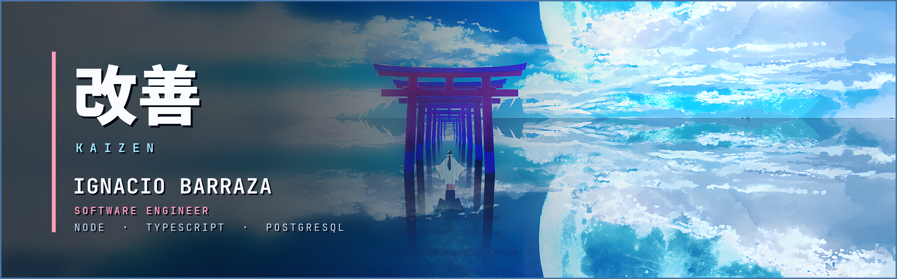
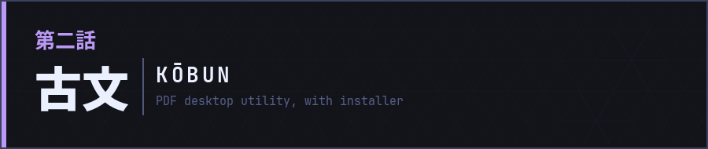

  

**Full Stack Developer** at **MapVx** &nbsp;·&nbsp; Iquique, Chile 🇨🇱

---

### 　あらすじ　·　Synopsis

Full stack by trade, backend by choice. I build at **MapVx**, mostly with Node, TypeScript
and PostgreSQL. Lately I've started learning **distributed systems**, **Spring Boot** and **AWS**.

I like systems that hold under load and still read clearly six months later.
Off the clock: anime, manga, light novels, and learning 日本語 at a very patient pace.

---

## 🌿 得意 · What I work with

<table>
<tr>
<td align="right" width="150"><b>言語</b> Languages</td>
<td>

</td>
</tr>
<tr>
<td align="right"><b>裏方</b> Backend</td>
<td>

</td>
</tr>
<tr>
<td align="right"><b>表側</b> Frontend</td>
<td>

</td>
</tr>
<tr>
<td align="right"><b>data</b> Storage</td>
<td>

</td>
</tr>
<tr>
<td align="right"><b>道具</b> Tooling</td>
<td>

</td>
</tr>
</table>

## 🌱 学習中 · Growing into

---

### 　作品集　·　Selected Works

A platform for running academic fairs and expos end to end: role-based access, project
submissions, judging panels, live metrics and Excel/PDF export. The backend runs on a
hexagonal architecture with TypeORM, Zod validation, JWT + HttpOnly cookies and rate limiting.

**`TypeScript`** **`Express`** **`PostgreSQL`** **`TypeORM`** &nbsp;·&nbsp;
[**backend**](https://github.com/IgnacioBarraza/hyosei_backend) &nbsp;·&nbsp;
[**frontend**](https://github.com/IgnacioBarraza/Hyosei)

 

A desktop tool for splitting and organizing PDFs, born from surviving my CS coursework.
Themed UI, page-range selection, and a proper Windows installer.

**`Python`** **`Tkinter`** **`PyPDF2`** **`Inno Setup`** &nbsp;·&nbsp;
[**repo**](https://github.com/IgnacioBarraza/kobun)

 

My Ubuntu development environment, reproducible in a single command: Zsh, Starship, Neovim,
Docker, Node, Python and Go — plus three Japanese-inspired terminal themes.

**`Shell`** **`Python`** &nbsp;·&nbsp;
[**repo**](https://github.com/IgnacioBarraza/dotfiles)

---

### 　統計　·　Stats

 

**Spanish** native &nbsp;·&nbsp; **English** C1 &nbsp;·&nbsp; **日本語** learning

改善 — <i>kaizen</i> · continuous improvement

