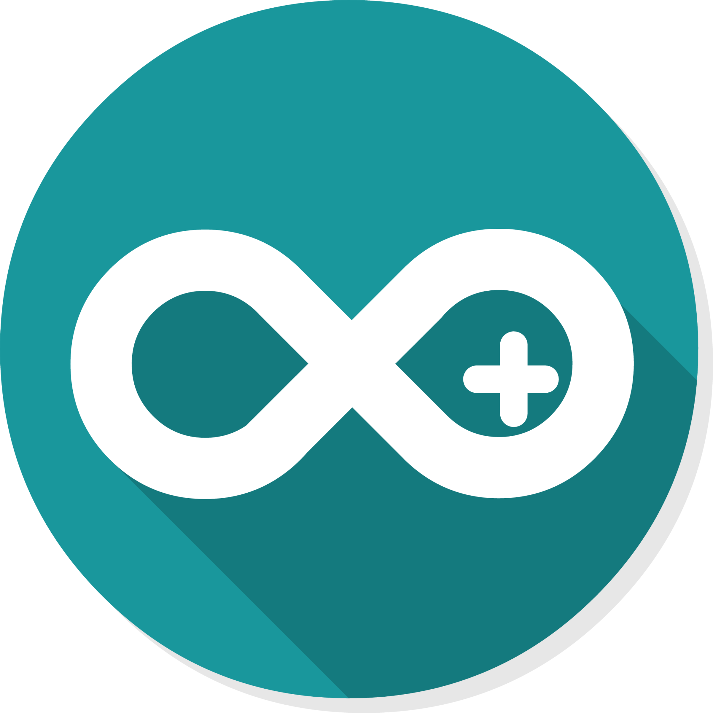
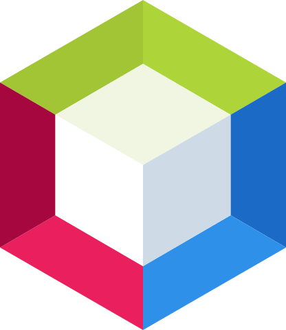

# Hey! 👋

 
 
 

# About ME 💬:

### - I'm 21 years old Software Engineer, Full Stack Developer, Game Dev student & Robotic enthusiast from Chile 🇨🇱

### - Learning: 
- ✨ Full Stack Development
- ✨ Game development
- ✨ Robotic things (ROS, C++, Etc)

### Hobbies: 
- ⛩️ Trying to learn Japanese (emphasis on trying XD)
- ⛩️ Watching anime
- ⛩️ Reading Manga & Ligth Novels
- 🎮 Game player (cs:go, genshin impact, Apex Legends, Overwatch2)

### Languages:
- ✨ Spanish (native language)
- ✨ English (C2/C1)
- ⛩️ Learning Japanese

# Languages & FrameWorks & Tools 👨‍💻🛠️:
 

  
  
  
  

 

  
  
  
  
  

  
  

  
  
  
  

 
 
 

# Work Experience
- Full Stack Developer at [@Lazarillo/MapVX](https://mapvx.com/);
- Assistant of the data base course at Universidad de Tarapacá;
- Assistant of the introduction to project formulation course at Universidad de Tarapacá;
- Assistant of the TIC's course at Universidad de Tarapacá;

# Contact Me:

 

If you want to reach out to me about anything, be it some doubt or just to ask something just ping me 😉.

 
 
 
 
 
 
 

# Github Stats 🤔

    
    

<!---
IgnacioBarraza/IgnacioBarraza is a ✨ special ✨ repository because its `README.md` (this file) appears on your GitHub profile.
You can click the Preview link to take a look at your changes.
--->
